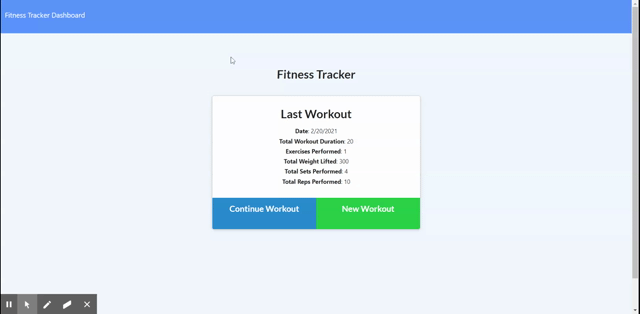

# Homework_17_Fitness_Tracker

## Table of Contents 

* [Description](#description)
* [Screenshot](#screenshot)
* [Questions](#questions)
* [License](#license)

## Description 

This application is designed to provide a user with the ability to store workouts and add various exercises to each workout to track their fitness.  There is also a dashboard that will show their progress over the past 7 days.   

## Screenshot

## Questions

Please reach out to me if you have any questions.

GitHub User Profile - https://github.com/jrod3323

My Email Address - jrod3323@gmail.com

## License

This application is covered under the following license: General Public License.  For full description of the license please [Click Here](https://choosealicense.com/licenses/gpl-3.0/)